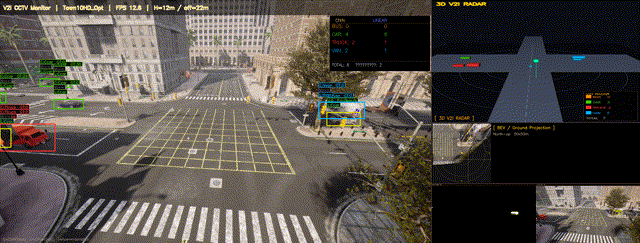
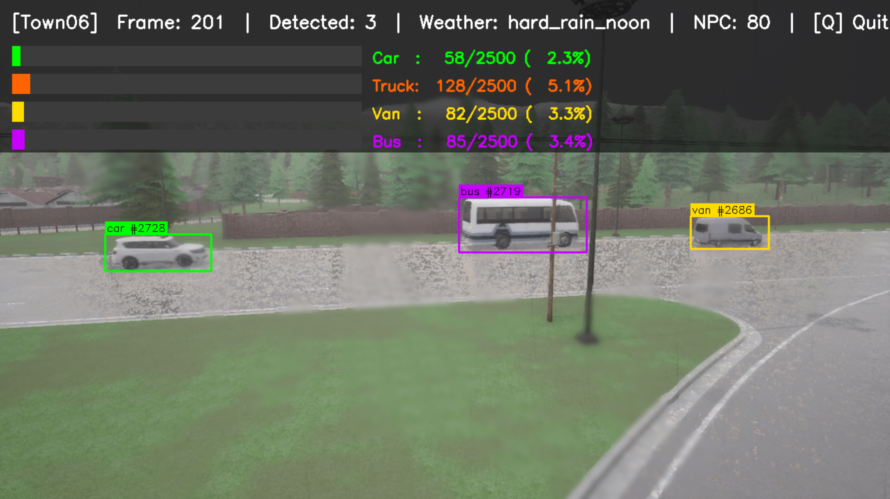
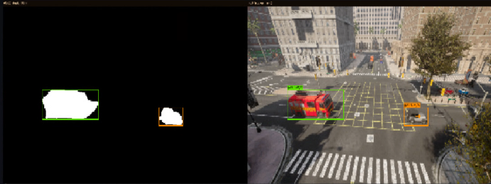
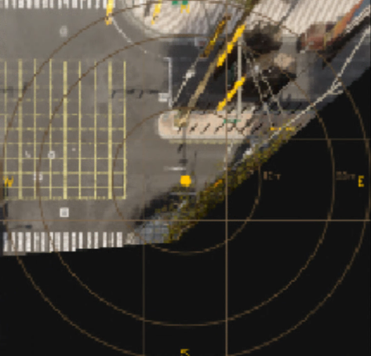
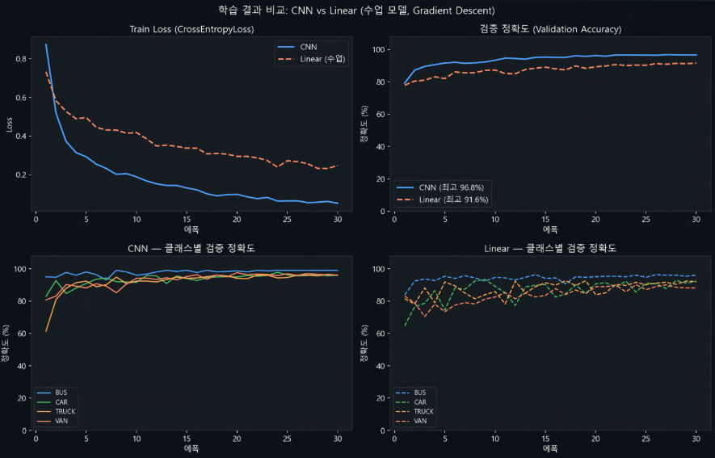
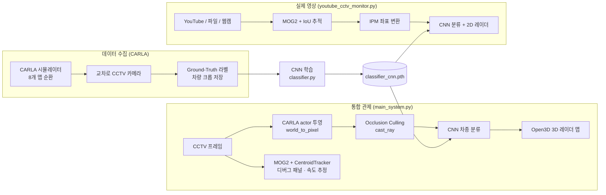

# CARLA 기반 V2I 스마트 교차로 3D 관제 시스템

YOLO 없이 **고전 컴퓨터 비전(MOG2 · IPM)** 과 **경량 CNN** 만으로 고정 CCTV 영상에서 차량을 검출·분류하고, 교차로 상황을 3D 레이더 맵으로 시각화하는 V2I(Vehicle-to-Infrastructure) 관제 파이프라인입니다. CARLA 시뮬레이터로 데이터를 수집·검증하고, 동일 비전 파이프라인을 실제 CCTV/영상에도 적용합니다.

> KDT 딥러닝 & OpenCV 과정 팀 프로젝트

---

## 데모



| 데이터 수집 (CARLA) | 실시간 비전 (MOG2) |
|:---:|:---:|
|  |  |
| Town06·우천 시나리오에서 차종별 자동 수집<br/>(BBox + 라벨 + 클래스별 수집 카운트 HUD) | 실제 CCTV 영상에 MOG2 배경차분 적용<br/>(좌: 전경 마스크 / 우: 차량 검출 박스) |

| BEV / 레이더 맵 | CNN vs Linear 학습 비교 |
|:---:|:---:|
|  |  |
| IPM 조감 좌표 + 거리 원 레이더 오버레이 | 동일 조건 학습 — CNN 96.8% vs Linear 91.6% |

학습 결과 그래프 원본은 [`results/`](results/) 에 포함되어 있습니다 (학습 곡선 · 혼동 행렬 · 모델 비교 · 과적합 점검).

---

## 개요

교차로에 설치된 고정 CCTV 영상에서 **딥러닝 객체검출기(YOLO 등) 없이** 차량을 인식하는 것을 목표로 했습니다. 움직이는 객체는 배경차분(MOG2)으로 검출하고, 차종 분류만 경량 CNN으로 처리해 연산량을 낮췄습니다. CARLA 시뮬레이터는 (1) 라벨이 보장된 학습 데이터를 대량 수집하고, (2) 카메라 기하·occlusion 등 실제 설치 조건을 재현해 파이프라인을 검증하는 용도로 사용했습니다.

### 핵심 기능

- **CARLA 기반 데이터 수집** — 8개 맵(Town01~07, Town10HD)을 자동 순환하며 교차로 코너 CCTV 시점에서 차량 크롭 이미지를 수집. 4개 차종(car/truck/van/bus) 균등 수집 및 대형차 BBox 클리핑 처리.
- **경량 CNN 차종 분류** — 4-Block CNN(+ Global Average Pooling)으로 car/truck/van/bus 4클래스 분류. 동일 조건의 Linear(MLP) 모델과 정량 비교.
- **3D V2I 레이더 맵** — Open3D 기반으로 교차로 전체를 3D로 렌더링. 차량 박스·진행 방향·V2I 신호선·거리 원호를 표시.
- **Occlusion Culling** — CARLA `cast_ray` 로 건물 뒤에 가려진 차량을 검출 목록에서 제외.
- **고전 비전 트래킹** — MOG2 배경차분 + CentroidTracker(거리/IoU 매칭)로 차량 ID·속도·방향 추정.
- **실제 영상 모니터링** — YouTube 스트림 / 동영상 파일 / 웹캠 입력에 동일 비전 파이프라인을 적용(`youtube_cctv_monitor.py`).

---

## 시스템 아키텍처



**탐지 방식 구분 (정직한 기술):**

- **CARLA 통합 관제(`main_system.py`)**: 시뮬레이터에서 ground-truth가 보장되므로, 차량 위치는 CARLA actor 목록을 카메라로 투영(`world_to_pixel`)해 정확히 얻고 occlusion만 `cast_ray`로 처리합니다. CNN은 차종 분류에 사용하며, MOG2 + CentroidTracker는 디버그 패널과 속도 추정에 함께 표시됩니다.
- **실제 영상 모니터링(`youtube_cctv_monitor.py`)**: ground-truth가 없으므로 검출 자체를 MOG2 배경차분 + IoU 추적으로 수행하고, IPM으로 도로 평면 좌표를 추정해 2D 레이더에 표시합니다.

---

## 기술 스택

| 분류 | 사용 기술 |
|------|-----------|
| 언어 | Python 3.10 |
| 시뮬레이터 | CARLA 0.9.16 / 0.10.0 |
| 딥러닝 | PyTorch, torchvision |
| 컴퓨터 비전 | OpenCV (MOG2, IPM), NumPy |
| 3D 시각화 | Open3D |
| 학습 분석 | scikit-learn, matplotlib, seaborn |

---

## 설계 하이라이트 / 엔지니어링 결정

- **CNN vs Linear 정량 비교** — 같은 데이터·에폭(30)·학습률 조건에서 경량 CNN과 Linear(MLP)를 학습해 비교했습니다. 측정 결과 CNN이 더 작은 모델로 더 높은 정확도를 보였습니다.

  | 모델 | 검증 정확도(best) | 학습 시간(CPU) | 가중치 크기 |
  |------|------------------|----------------|-------------|
  | CNN (4-Block + GAP) | **96.8%** | 약 559초 | 약 4.9 MB |
  | Linear (MLP) | 91.6% | 약 455초 | 약 51 MB |

  > 공간 구조를 무시하는 MLP는 1층(12288→1024) 파라미터가 비대해 모델이 10배 이상 커지면서도 정확도는 낮았습니다. 합성곱이 차종 분류에 적합함을 정량적으로 확인했습니다.

- **클래스 불균형 보정** — bus 샘플이 상대적으로 부족해 `WeightedRandomSampler` 로 균형 샘플링하고, 학습/검증 분할은 클래스별 stratified 분리로 transform 오염을 차단했습니다.

- **라벨 플리커링 완화** — 프레임마다 분류가 튀는 문제를, 신뢰도 임계값(낮으면 `uncertain` 반환) + 투표 캐시 + `CLASSIFY_INTERVAL` 주기 분류로 안정화했습니다.

- **속도 추정 안정화** — MOG2 잔상·IPM 좌표 흔들림에 의한 정지 차량 허위 속도와 신규 트랙의 속도 스파이크를, 변위 임계값·EMA 평활화·초기 프레임 속도 0 처리·상한 클리핑(80km/h)으로 보정했습니다.

- **CARLA 데이터 수집 안정화** — 맵별 고유 TrafficManager 포트로 도로 이탈/역주행을 방지하고, 다중 맵 자동 순환 과정의 sync↔async 전환 시 클라이언트가 조용히 종료되던 문제를 `world.apply_settings` 호출 제거 + `tick()` flush 방식으로 해결했습니다.

---

## 내 담당

팀 프로젝트이며, 본인이 직접 담당/기여한 범위는 다음과 같습니다.

- **전담: `src/classifier.py`** — 경량 CNN 설계·학습, 수업에서 다룬 Linear(MLP) 모델과의 정량 비교 실험, 결과 그래프(학습 곡선·혼동 행렬·모델 비교·과적합 점검) 자동 생성, 추론 인터페이스(`classify_with_conf`) 구현.
- **통합 참여: `src/main_system.py`** — CNN 분류기 연동 및 3D 관제 파이프라인 통합 작업에 참여.
- **보조 기여: `src/data_collector.py`, `src/vision_processor.py`** — 데이터 수집 및 비전 처리 모듈 일부 기여.

> 원 팀 구성상 모듈별 1차 담당: 데이터 수집(`data_collector.py`), 비전 처리(`vision_processor.py`)는 다른 팀원이 주도했습니다.

---

## 실행 방법

### 1. 환경 준비

```bash
python -m venv venv
venv\Scripts\activate          # Windows
pip install -r requirements.txt
```

CARLA Python API는 pip 패키지가 아니므로 설치 경로를 `PYTHONPATH`에 추가합니다.

```bash
set PYTHONPATH=%PYTHONPATH%;<CARLA설치경로>\PythonAPI\carla\dist\carla-0.9.16-py3.10-win-amd64.egg
```

### 2. 학습 데이터 수집 (CARLA 서버 실행 필요)

```bash
python src/data_collector.py
# data/vehicle_images/{car,truck,van,bus}/ 에 차종별 크롭 이미지 저장
```

> 수집된 데이터셋과 학습 가중치는 용량 문제로 저장소에 포함하지 않습니다(`.gitignore`). 위 절차로 재생성하세요.

### 3. CNN 학습 및 결과 그래프 생성

```bash
python src/classifier.py            # CNN + Linear 동시 학습 후 results/ 에 그래프 저장
python src/classifier.py --cnn      # CNN만 학습
python src/classifier.py --linear   # Linear만 학습
python src/regenerate_graphs.py     # 재학습 없이 저장된 가중치로 그래프만 재생성
```

### 4. 통합 관제 시스템 실행 (CARLA 서버 실행 필요)

```bash
python src/main_system.py
# 조작: q 종료 / r NPC 재소환
```

### 5. 실제 CCTV/영상 모니터링

```bash
python src/youtube_cctv_monitor.py --url "https://www.youtube.com/watch?v=XXXX"
python src/youtube_cctv_monitor.py --file road.mp4
python src/youtube_cctv_monitor.py --webcam 0
```

---

## 알려진 한계 / 향후 계획

- **검출의 시뮬레이션 의존** — CARLA 통합 관제는 검출에 ground-truth(actor 투영)를 사용합니다. 실제 영상 검출은 MOG2 기반이라 조명 변화·정체·보행자 환경에서 오탐이 발생할 수 있어, 실영상에서 MOG2 검출과 CNN 분류를 함께 평가하는 작업이 남아 있습니다.
- **MOG2의 한계** — 정지 차량·혼잡 상황에서 배경차분이 약합니다. 향후 광류(optical flow) 또는 경량 검출기로 보완을 검토합니다.
- **데이터 도메인 갭** — 학습 데이터가 CARLA 합성 이미지 기반이라 실제 CCTV와의 도메인 차이가 존재합니다. 실영상 라벨 일부를 추가한 fine-tuning이 필요합니다.
- **성능 측정 범위** — 보고한 정확도는 CARLA 합성 데이터의 검증셋 기준이며, 실차 환경의 정량 평가는 아직 수행하지 않았습니다.
- **실영상 속도는 20fps 가정** — 속도 추정은 `vision_processor.py`의 `FPS_ESTIMATE = 20.0`(CARLA 틱 레이트)을 사용합니다. 실제 영상의 프레임레이트가 20fps와 다르면 km/h 값에 비례 오차가 생깁니다.
- **IPM은 CARLA 카메라 기하 전용** — `IPM_SRC_POINTS`는 CARLA CCTV 기하(높이 12m·pitch −25°·FOV 110°·1280×720)에서 역산한 4점이라, 설치 높이·각도가 다른 실제 CCTV에는 그대로 적용되지 않습니다(영상별 재캘리브 필요).

---

## 트러블슈팅

### BEV 좌표/스케일 정합

**증상** — BEV(조감) 영상이 왜곡되거나 좌우·상하가 반전되고, IPM 레이더 좌표가 실제 미터 스케일과 어긋남.

**원인**

1. **CARLA UE4 좌표계 ↔ 카메라/이미지 축 매핑** — CARLA는 left-handed(UE4) 좌표계(forward=x, right=y, up=z)를 씁니다. `src/main_system.py`의 `world_to_pixel()`과 `src/data_collector.py`의 `world_to_pixel()`은 카메라 좌표를 이미지 축으로 `x_img = y_cam`, `y_img = -z_cam`(상하 부호 반전), `z_img = x_cam`(깊이)로 변환하고 `z_img <= 0`(카메라 뒤)이면 `None`을 반환합니다. `compute_bev()`도 같은 규약(`x_img = pts_cam[:,1]`, `y_img = -pts_cam[:,2]`, `z_dep = pts_cam[:,0]`)을 따릅니다. 이 축·부호 변환이 어긋나면 BEV가 반전·왜곡됩니다.
2. **IPM 4점을 임의로 찍어 지면 사각형이 안 맞던 문제** — `src/vision_processor.py`의 `IPM_SRC_POINTS`는 임의 점이 아니라, 주석에 기록된 대로 지면 직사각형(카메라 전방 6~28m, 좌우 ±6m = 22m×12m)의 코너를 카메라 투영으로 역산한 이미지 좌표 `FL(552,346) · FR(728,346) · NR(896,716) · NL(384,716)`로 지정돼 있습니다.

**해결** (코드/주석에서 확인되는 범위)

- **IPM 4점 역산** — 위 지면 직사각형 코너의 카메라 투영 좌표로 `IPM_SRC_POINTS`를 정의하고, `IPM_DST_POINTS`(400×400)와 함께 `cv2.getPerspectiveTransform`으로 IPM 행렬을 만듭니다(`VisionProcessor.__init__`). `_pixel_to_world()`는 BBox bottom-center(지면 접촉점)를 IPM 투영한 뒤 `PIXELS_PER_METER`로 나눠 미터 좌표를 산출합니다.
- **BEV 역투영** — `compute_bev()`는 각 BEV 픽셀 → 지면 평면(z=junc_z) 월드 좌표 → 카메라 투영(`cam_inv @ pts_world`)으로 원본 프레임 색을 샘플링하는 정사영(inverse warping) 방식이며, North-up(`v=0`→North, East=+X, South=+Y) 그리드로 구성됩니다.
- **Open3D 미러 보정** — `main_system.py`에서 Open3D 캡처 화면에 `cv2.flip(bgr, 1)`을 적용합니다(주석: "좌우 미러 보정: Open3D에서 East(+X)가 왼쪽으로 나오는 현상 수정").

> **한계** — 위 좌표·축·미러 정합은 맞췄지만, `compute_bev()`는 full-frame IPM(전체 화면 역투영)이라 지면 평면을 가정합니다. 그래서 지면 위로 솟은 차량은 원거리에서 줄무늬처럼 번지고, BEV 영상 자체의 품질은 제한적입니다. 또 GT(actor 투영) 기반 관제 파이프라인에서는 BEV가 실제 판단에 쓰이지 않습니다 — 차량 위치 표현은 GT 좌표 기반 3D 레이더(Open3D)가 더 정확하며, BEV는 보조 시각화에 그칩니다.

## 디렉터리 구조

```
carla_v2i_monitor/
├── src/
│   ├── data_collector.py       # CARLA CCTV 데이터 수집 (8개 맵 순환, 4클래스)
│   ├── classifier.py           # CNN/Linear 학습·비교·결과 그래프 생성
│   ├── vision_processor.py     # MOG2 배경차분 + CentroidTracker + IPM
│   ├── main_system.py          # 통합 관제 (actor 투영 + CNN + Open3D 3D 레이더)
│   ├── youtube_cctv_monitor.py # 실제 영상(YouTube/파일/웹캠) 모니터링
│   └── regenerate_graphs.py    # 저장된 가중치로 결과 그래프만 재생성
├── results/                    # 학습 결과 그래프 (PNG)
├── picture/                    # README 데모 스크린샷
├── data/                       # 학습 데이터 (gitignore — 재생성)
├── models/                     # 학습 가중치 (gitignore — 재생성)
├── requirements.txt
├── .gitignore
└── README.md
```
